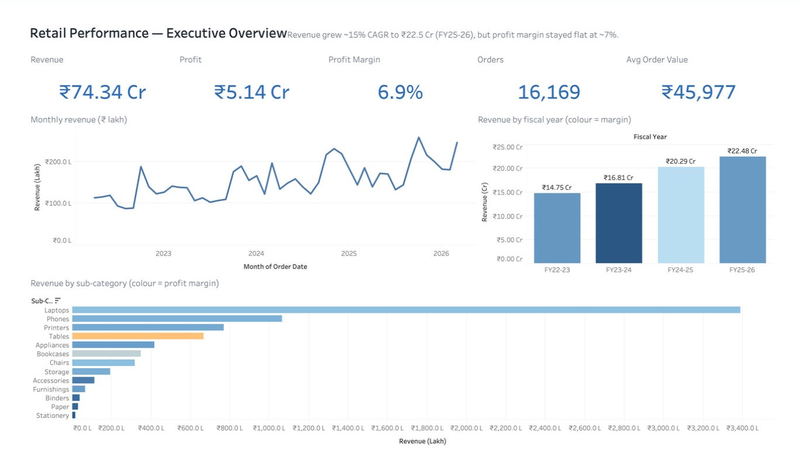
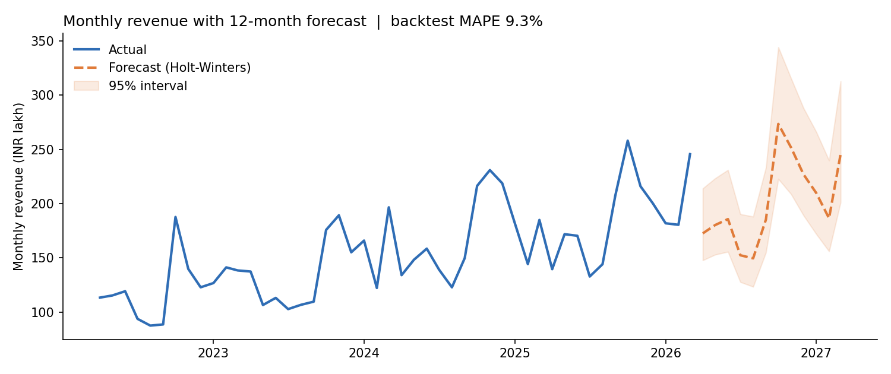
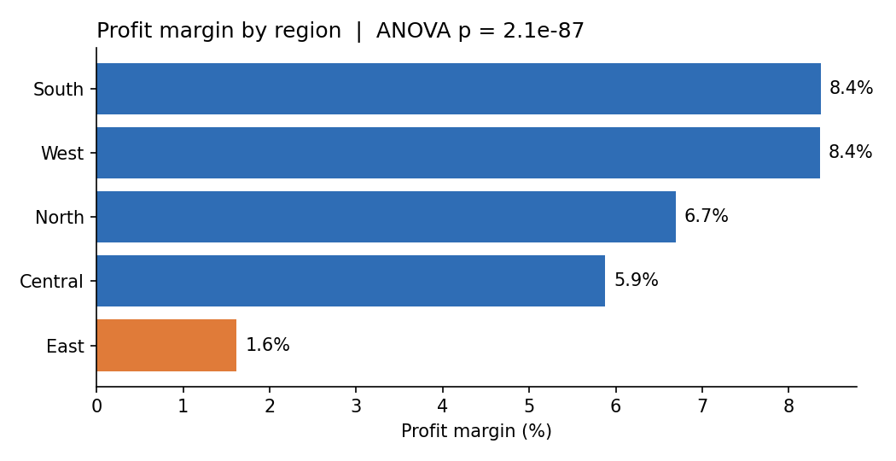
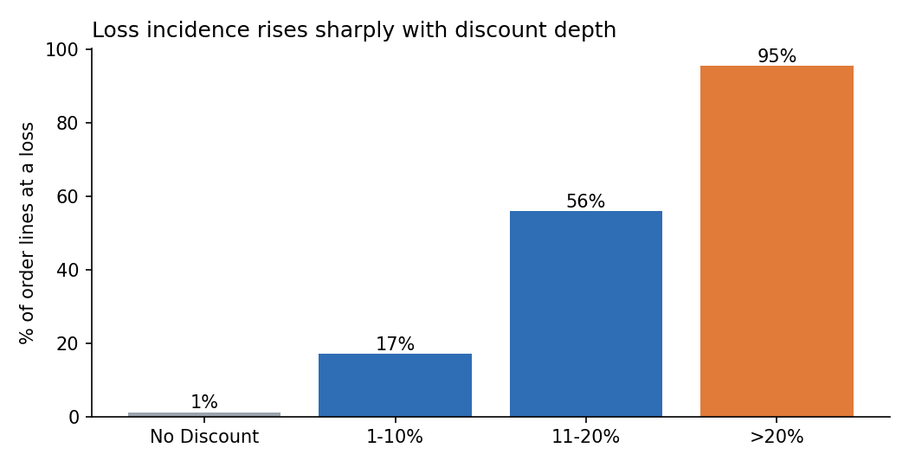
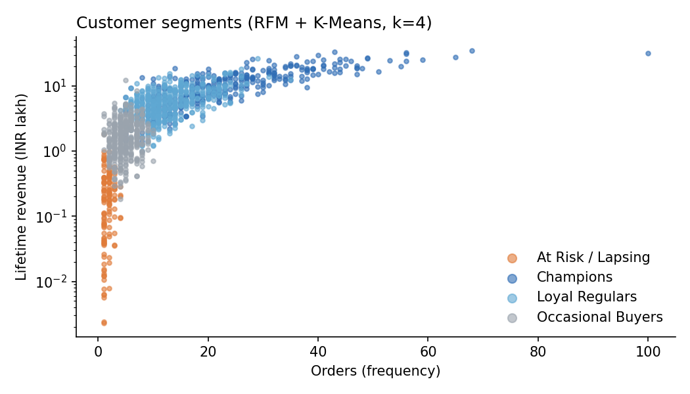

# Retail Performance Analytics — India (Tableau & Power BI)

Interactive **Tableau and Power BI** dashboards tracking **revenue, profitability and regional performance** for a multi-region Indian retailer (FY22-23 to FY25-26), backed by Python-based **customer segmentation, statistical testing and revenue forecasting**.

🔗 **Tableau (live):** `<YOUR_TABLEAU_PUBLIC_LINK>`  
📊 **Power BI:** [`powerbi/Retail_Performance_Analytics.pbix`](powerbi/) · PDF export in the same folder

---

## Business questions

1. How fast is the business growing, and is growth profitable?
2. Which regions, categories and products create or destroy profit — and why?
3. How deep can discounts go before orders turn loss-making?
4. Which customers drive revenue, and who is at risk of lapsing?
5. What revenue should we plan for next fiscal year?

## Key findings

| Area | Insight |
|------|---------|
| Growth | Revenue grew from ₹14.8 Cr (FY22-23) to ₹22.5 Cr (FY25-26), a **~15% CAGR**, but profit margin stayed flat at **~7%**. |
| Regions | Margins differ significantly by region (**ANOVA p < 0.001**). **East earns 1.6%** vs **8.4% in South/West**. |
| Discounting | Loss incidence rises from **1% (no discount) → 17% (1–10%) → 56% (11–20%) → 95% (>20%)** (χ² p < 0.001). Each +1pp discount cuts margin by **~1.3pp** (OLS, R² = 0.83); break-even discount ≈ **10%**. |
| Products | **Tables** is the 4th-largest sub-category by revenue yet **loses ₹16.6 lakh**; Laptops and Phones generate ~58% of profit. |
| Customers | RFM + K-Means (k=4): **Champions are 26% of customers but 52% of revenue**; 10% of customers are At Risk / Lapsing. |
| Forecast | Holt-Winters model projects **₹24.2 Cr** for the next 12 months (+7.6%), with a festive-season (Oct–Nov) peak. Backtest MAPE **9.3%** vs 12.9% for a seasonal-naive baseline. |

### Recommendations
- Cap standard discounts at **10%**; require approval above it, especially in East and for Furniture. Upper-bound profit upside ≈ **₹1.8 Cr** over the period if volumes hold.
- Reprice or rationalise **Tables** (e.g. bundle with Chairs, reduce discount depth).
- Run a retention campaign for **At Risk** customers and a loyalty tier for **Champions**.
- Build inventory and staffing plans around the Oct–Nov festive peak and March fiscal year-end push.

## Dashboards

The same three-page story is built in both tools on identical data, so results reconcile exactly.

| Dashboard | Content |
|-----------|---------|
| **Executive Overview** | KPI cards (Revenue, Profit, Margin, Orders, AOV), monthly trend with metric switcher, YoY growth, category mix |
| **Regional & Profitability Drivers** | India state map, region margin vs average, discount-vs-margin scatter with trend line, loss rate by discount band, sub-category profit |
| **Customers & Forecast** | RFM segment share, customer scatter, 12-month revenue forecast with 95% interval |

**Tableau:** click-to-filter map actions, highlight actions, a *Select Metric* parameter, FY/Region/Segment filters, navigation buttons.  
**Power BI:** star-schema model with a fiscal-year date table, ~45 DAX measures (FYTD, YoY, CAGR, share-of-total, discount-cap profit upside), field-parameter metric switcher, synced slicers, drill-through and tooltip pages, **Key Influencers** and **Decomposition Tree** AI visuals for driver analysis, dynamic DAX titles.

| | Tableau | Power BI |
|---|---|---|
| Data prep | Relationships in data source | Power Query (M) with parameterised folder path |
| Calculations | Calculated fields, LOD, table calcs | DAX measures + time intelligence |
| Driver analysis | Trend line (R², p-value) | Key Influencers, Decomposition Tree |
| Forecast | Python Holt-Winters + Tableau forecast cross-check | Python Holt-Winters + Power BI ETS forecast cross-check |

<!-- Replace with your screenshots after building -->
<!--  -->
<!--  -->

### Analysis previews (Python)

| Forecast | Region margin |
|---|---|
|  |  |

| Discount vs loss | Customer segments |
|---|---|
|  |  |

## Methodology

**Data** — 32,172 order lines / 16,169 orders / 1,339 customers across 5 regions, 16 states, 13 sub-categories. Synthetic dataset generated with realistic patterns (festive seasonality, discount-driven margin erosion, regional cost differences) because real retailer data is confidential. Generator is fully reproducible (`seed=42`).

**Pipeline** (`scripts/02_analysis.py`)
1. **Cleaning & features** — Indian fiscal year (Apr–Mar), profit margin, discount bands, ship lag, loss flag.
2. **Segmentation** — RFM scores (quintiles) + K-Means on log-scaled R/F/M; clusters labelled by value and recency.
3. **Statistical analysis**
   - One-way ANOVA + Kruskal-Wallis: order margin by region
   - Chi-square test: loss incidence vs discount band
   - OLS regression (robust HC3 errors): margin ~ discount + region + category + segment + channel + log(order size)
4. **Forecasting** — Holt-Winters (additive trend, multiplicative 12-month seasonality), 6-month holdout backtest vs seasonal-naive, bootstrapped 95% prediction intervals.
5. **Export** — Tableau- and Power BI-ready CSVs in `data/processed/`.

## Repository structure

```
retail-performance-analytics/
├── data/
│   ├── raw/retail_sales.csv            # generated order-line data
│   └── processed/
│       ├── sales_enriched.csv          # main fact table (both tools)
│       ├── customer_segments.csv       # RFM + cluster per customer
│       ├── revenue_forecast.csv        # actual + 12-month forecast with intervals
│       └── region_fy_summary.csv
├── scripts/
│   ├── 01_generate_data.py
│   └── 02_analysis.py
├── tableau/
│   ├── TABLEAU_BUILD_GUIDE.md          # step-by-step build instructions
│   └── Retail_Performance_Analytics.twbx   # (add after building)
├── powerbi/
│   ├── POWERBI_BUILD_GUIDE.md          # step-by-step build instructions
│   ├── power_query.m                   # data load & typing
│   ├── measures.dax                    # date table + all DAX measures
│   ├── theme.json                      # report theme
│   └── Retail_Performance_Analytics.pbix   # (add after building)
├── docs/
│   ├── analysis_summary.json           # all test statistics & KPIs
│   └── regression_output.txt           # full OLS summary
├── images/
├── requirements.txt
└── README.md
```

## Reproduce

```bash
pip install -r requirements.txt
python scripts/01_generate_data.py
python scripts/02_analysis.py
```
Then follow [`tableau/TABLEAU_BUILD_GUIDE.md`](tableau/TABLEAU_BUILD_GUIDE.md) and/or [`powerbi/POWERBI_BUILD_GUIDE.md`](powerbi/POWERBI_BUILD_GUIDE.md).

## Tools
Tableau Public · Power BI Desktop (Power Query, DAX) · Python (pandas, NumPy, scikit-learn, SciPy, statsmodels, matplotlib)

---
*Academic project — MBA, IIM Sambalpur.*
